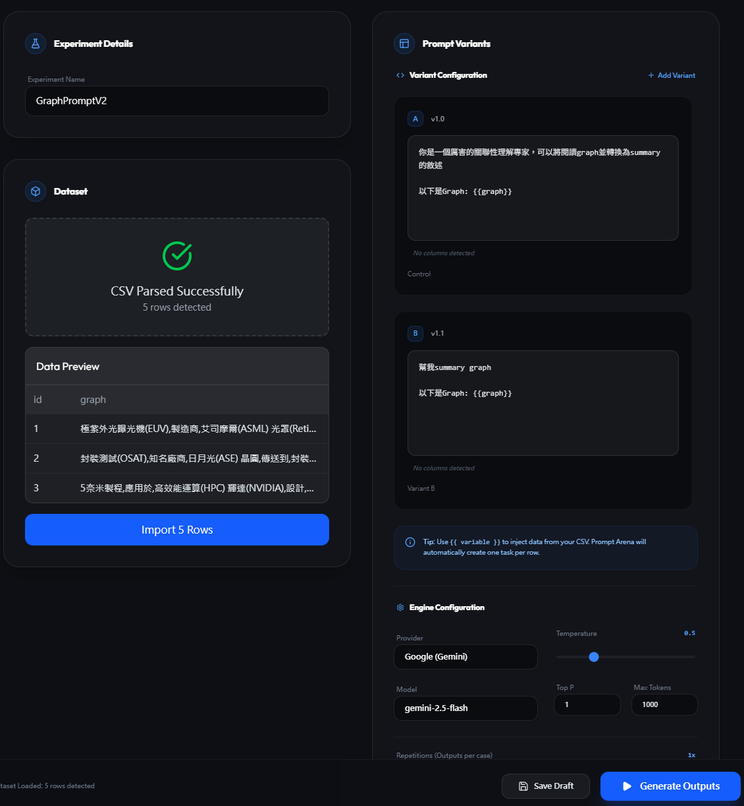
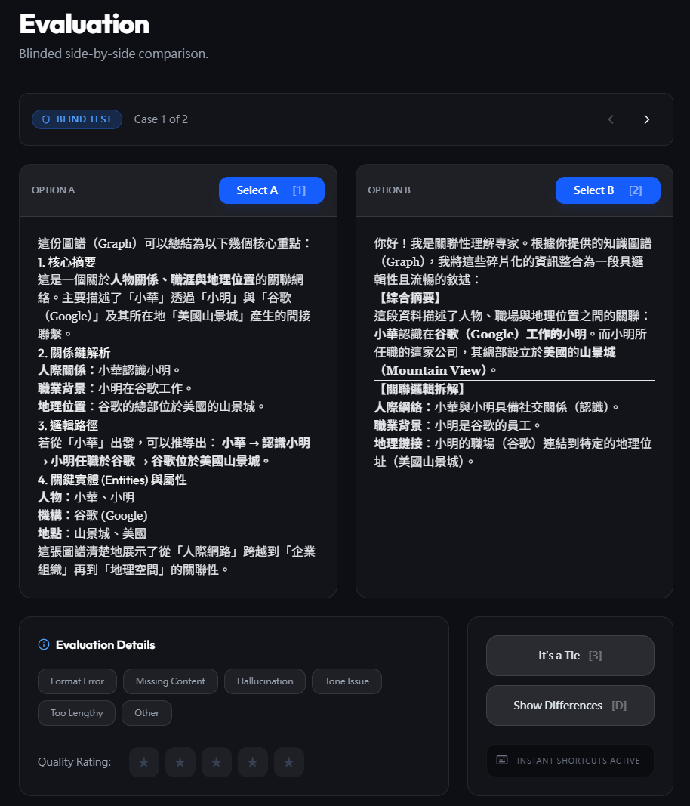
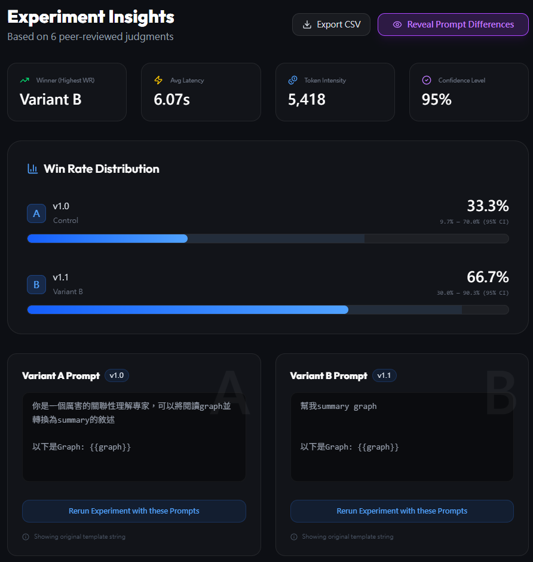

# Prompt Arena ⚔️

[](https://github.com/a07458666/PromptArena/actions/workflows/deploy.yml)
[](https://a07458666.github.io/PromptArena/)

A powerful, local-first prompt engineering and LLM evaluation tool. Rapidly compare different prompt variants and models side-by-side using your own datasets.



## Core Features
- **Side-by-Side Comparison**: Evaluate up to 4 prompt variants or models simultaneously.
- **Local-First & Private**: All data is stored locally in your browser (IndexedDB). API keys are pulled from environment variables or session storage.
- **Smart Batch Generation**: Support for CSV/JSON datasets. Automatically injects variables using `{{column}}` syntax.
- **Throttling & Resilience**: 
  - **Global Concurrency & Delay**: Fine-tune requests to avoid API rate limits (429).
  - **Automatic Retries**: Exponential backoff for handling intermittent API failures.
  - **Abort Control**: Stop generation at any time with a single click.
- **Blind Evaluation**: Randomize output positions to eliminate ordering bias during manual scoring.
- **Markdown Support**: Full rendering for rich model outputs.

## Getting Started

### 1. Requirements
- Node.js (v18+)
- LLM API Keys (OpenAI, Anthropic, or Google Gemini)

### 2. Installation
```bash
git clone https://github.com/your-repo/PromptArena.git
cd PromptArena
npm install
```

### 3. Configuration
Create a `.env` file in the root directory:
```env
VITE_OPENAI_API_KEY=your_key_here
VITE_ANTHROPIC_API_KEY=your_key_here
VITE_GOOGLE_API_KEY=your_key_here
```

### 4. Development
```bash
npm run dev
```

## Workflow

### Setup & Variant Editing
Upload your test data and craft your prompt variants. Use placeholders like `{{context}}` to match your CSV columns.



### Side-by-Side Evaluation
Vote for the best output, rate quality, and tag issues. Order is randomized by default to ensure fair testing.

### Results & Analysis
Review comprehensive stats, win rates, and detailed output comparisons.



## Tech Stack
- **Framework**: React 19 + Vite
- **Styling**: Tailwind CSS (Lucide Icons + Framer Motion)
- **Database**: Dexie.js (IndexedDB)
- **Evaluation**: Custom Side-by-Side Logic

## License
MIT
